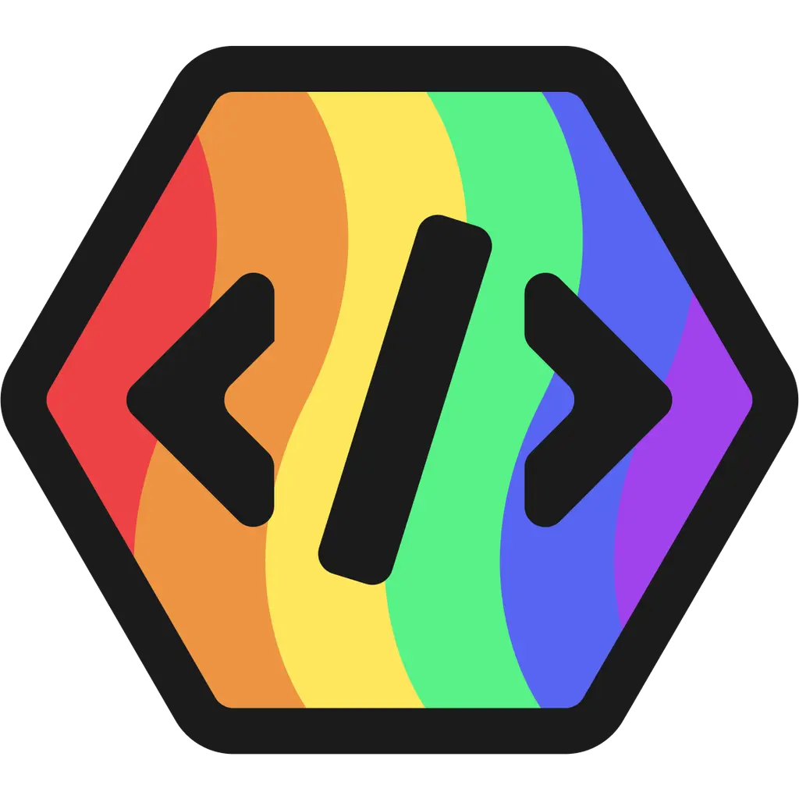

#  Pridebot-OSM

## Introduction

Pridebot-OSM, developed by [Sdriver1](https://sdriver1.me), is a multi function LGBTQIA+ themed Osmium bot made from it's discord application counterpart. Current still under development as Osmium grows in it's development but always looking ideas or ways to grow!

## Commands

All commands use the `!` prefix.

| Command  | Description                                                 | Usage                |
| -------- | ----------------------------------------------------------- | -------------------- |
| `ping`   | Check if the bot is alive and measure latency.              | `!ping`              |
| `gaydar` | Measures how gay someone is with a random percentage.       | `!gaydar [username]` |
| `help`   | Shows a list of commands, or info about a specific command. | `!help [command]`    |
| `invite` | Invite the bot to your server                               | `!invite [link]`     |

## Support

For support, questions, or feedback about Pridebot, please join our Osmium community [here](https://osm.pm/i/JFfIIoNjbXK5x2D9).
For anyone who wants to donate/support the development of Pridebot, you can do that [here](https://pridebot.xyz/premium)

## 📜 Legal

| Document                                                                          | Description                |
| --------------------------------------------------------------------------------- | -------------------------- |
| [Terms of Service](https://pridebot.xyz/tos)                                      | Usage terms and conditions |
| [Privacy Policy](https://pridebot.xyz/privacy)                                    | How we handle your data    |
| [MIT License](https://github.com/Pridebot-Systems/Pridebot-OSM?tab=MIT-1-ov-file) | Open source license        |

---

**Made with ❤️ by the Pridebot team**

_Pridebot © 2023-2026_
